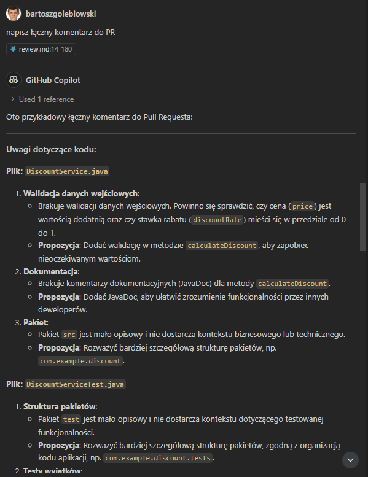

### Tytuł: **Recenzja kodu z użyciem AI**

#### Dlaczego to ważne:
Code review to kluczowy proces zapewniania jakości kodu. Dzięki niemu można wcześnie wykryć błędy, poprawić czytelność i zgodność ze standardami. AI automatyzuje ten proces, oszczędzając czas i poprawiając efektywność.

---

#### Wady bez AI:
- **Czasochłonność**: Wymaga zaangażowania zespołu, co opóźnia pracę.
- **Subiektywność**: Jakość recenzji zależy od doświadczenia recenzenta.

---

#### Zalety z AI:
- **Natychmiastowe wskazówki**: AI analizuje kod w czasie rzeczywistym.
- **Obiektywność**: Sugeruje poprawki zgodne z ustalonymi standardami.
- **Wsparcie dla najlepszych praktyk**: Pomaga w refaktoryzacji i wdrażaniu wzorców projektowych.

AI w recenzji kodu może przyspieszyć pracę, minimalizuje błędy i podnosi jakość oprogramowania.

# Przykład

### Scenariusz: **Code Review z użyciem AI – Prawdziwe przykłady kodu**

Załóżmy, że kolega Paweł dodał logikę obliczania rabatu oraz odpowiednie testy. Adam przeprowadza review jego gałęzi `feature/add-discount-calculation`.

---

#### Krok 1: Kod wprowadzony przez Pawła

**Plik: `DiscountService.java`**
```java
package src;

public class DiscountService {

    public double calculateDiscount(double price, double discountRate) {
        return price - (price * discountRate);
    }
}
```

---

**Plik: `DiscountServiceTest.java`**
```java
package test;

import org.junit.jupiter.api.Test;
import static org.junit.jupiter.api.Assertions.*;

public class DiscountServiceTest {

    @Test
    public void shouldApplyDiscountCorrectly() {
        DiscountService discountService = new DiscountService();
        double result = discountService.calculateDiscount(100, 0.1);
        assertEquals(90, result, 0.01);
    }

    @Test
    public void shouldReturnSamePriceForZeroDiscount() {
        DiscountService discountService = new DiscountService();
        double result = discountService.calculateDiscount(100, 0);
        assertEquals(100, result, 0.01);
    }
}
```

---

#### Krok 2: Wykorzystanie Copilot do analizy kodu

Adam otwiera plik `DiscountService.java` i korzysta z Copilot Chat, pytając:
> "Jesteś osoba odpowiedzialną za review, zrób review tej klasy."

##### Uwagi dotyczące klasy `DiscountService`

###### 1. Walidacja danych wejściowych
Brakuje walidacji danych wejściowych. Powinno się sprawdzić:
- Czy cena (`price`) jest wartością dodatnią.
- Czy stawka rabatu (`discountRate`) mieści się w przedziale od 0 do 1.

**Propozycja:**
Dodać walidację w metodzie `calculateDiscount`, aby zapobiec nieoczekiwanym wartościom.

---

###### 2. Dokumentacja
Brakuje komentarzy dokumentacyjnych (JavaDoc) dla metody `calculateDiscount`.  
Warto dodać:
- Opis metody.
- Wyjaśnienie parametrów.
- Informację o wartości zwracanej.

**Propozycja:**
Dodać JavaDoc, aby ułatwić zrozumienie funkcjonalności przez innych deweloperów.

---

###### 3. Pakiet
Pakiet `src` jest mało opisowy i nie dostarcza kontekstu biznesowego lub technicznego.

**Propozycja:**
Rozważyć bardziej szczegółową strukturę pakietów, np.:
- `com.example.discount`
- `com.example.services`

---

###### 4. Testy jednostkowe
Brakuje testów jednostkowych dla klasy `DiscountService`. Testy są kluczowe dla zapewnienia poprawności kodu w różnych scenariuszach.

**Propozycja:**
Dodać testy, aby uwzględnić:
- Standardowe przypadki.
- Przypadki brzegowe (np. `price = 0`, `discountRate = -0.1`, `discountRate = 1.5`).
- Obsługę błędnych danych wejściowych.

---

Adam przechodzi do pliku `DiscountServiceTest.java` i pyta Copilot:
> "Jesteś osoba odpowiedzialną za review, zrób review testów."

##### Uwagi dotyczące klasy `DiscountServiceTest.java`


###### 1. Struktura pakietów
Pakiet `test` jest mało opisowy i nie dostarcza kontekstu dotyczącego testowanej funkcjonalności.

**Propozycja:**
Rozważyć bardziej szczegółową strukturę pakietów, zgodną z organizacją kodu aplikacji, np.:
- `com.example.discount.tests`
- `com.example.services.tests`

---

###### 2. Testy wyjątków
Brakuje testów, które sprawdzają, czy metoda `calculateDiscount` rzuca odpowiednie wyjątki dla nieprawidłowych danych wejściowych, takich jak:
- Cena równa 0 lub ujemna (`price <= 0`).
- Stawka rabatu spoza przedziału 0–1 (`discountRate < 0` lub `discountRate > 1`).

**Propozycja:**
Dodać testy wyjątków, np.:
```java
@Test
public void shouldThrowExceptionForZeroPrice() {
    DiscountService discountService = new DiscountService();
    assertThrows(IllegalArgumentException.class, () -> discountService.calculateDiscount(0, 0.1));
}

@Test
public void shouldThrowExceptionForInvalidDiscountRate() {
    DiscountService discountService = new DiscountService();
    assertThrows(IllegalArgumentException.class, () -> discountService.calculateDiscount(100, 1.5));
}
```

---

#### Krok 3: Zapisanie uwag w systemie PR



## Uwagi dotyczące kodu:

### Plik: DiscountService.java

#### Walidacja danych wejściowych:
Brakuje walidacji danych wejściowych. Powinno się sprawdzić, czy cena (`price`) jest wartością dodatnią oraz czy stawka rabatu (`discountRate`) mieści się w przedziale od 0 do 1.
**Propozycja:** Dodać walidację w metodzie `calculateDiscount`, aby zapobiec nieoczekiwanym wartościom.

#### Dokumentacja:
Brakuje komentarzy dokumentacyjnych (JavaDoc) dla metody `calculateDiscount`.
**Propozycja:** Dodać JavaDoc, aby ułatwić zrozumienie funkcjonalności przez innych deweloperów.

#### Pakiet:
Pakiet `src` jest mało opisowy i nie dostarcza kontekstu biznesowego lub technicznego.
**Propozycja:** Rozważyć bardziej szczegółową strukturę pakietów, np. `com.example.discount`.

---

### Plik: DiscountServiceTest.java

#### Struktura pakietów:
Pakiet test jest mało opisowy i nie dostarcza kontekstu dotyczącego testowanej funkcjonalności.
**Propozycja:** Rozważyć bardziej szczegółową strukturę pakietów, zgodną z organizacją kodu aplikacji, np. `com.example.discount.tests`.

#### Testy wyjątków:
Brakuje testów, które sprawdzają, czy metoda `calculateDiscount` rzuca odpowiednie wyjątki dla nieprawidłowych danych wejściowych, takich jak cena równa 0 lub ujemna (`price <= 0`) oraz stawka rabatu spoza przedziału 0–1 (`discountRate < 0` lub `discountRate > 1`).
**Propozycja:** Dodać testy wyjątków.

---


### Podsumowanie:
Dzięki AI Adam szybko zidentyfikował brakujące walidacje i testy, co podniosło jakość kodu bez dużego nakładu czasu. Review było precyzyjne i wartościowe, mimo że Adam miał ograniczony czas.