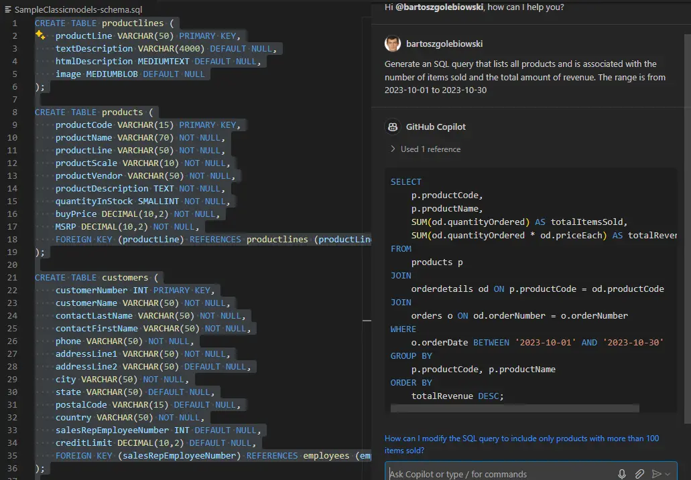

### Tytuł: **Generowanie zapytań SQL na podstawie schematu bazy danych**

#### Dlaczego to ważne:
Tworzenie zapytań SQL to kluczowy element pracy z bazami danych, szczególnie w zadaniach raportowych. Z pomocą GitHub Copilot możemy zautomatyzować ten proces, co oszczędza czas i redukuje błędy. Dzięki analizie schematu bazy danych, Copilot potrafi wygenerować skomplikowane zapytania SQL spełniające konkretne wymagania biznesowe.

---

#### Wady bez AI:
- **Czasochłonność**: Pisanie złożonych zapytań SQL wymaga głębokiej znajomości struktury bazy danych i języka SQL.
- **Błędy logiczne**: Ręczne tworzenie zapytań zwiększa ryzyko błędów, takich jak niewłaściwe złączenia czy nieprawidłowe filtry.
- **Brak standaryzacji**: Różni programiści mogą pisać zapytania w sposób niespójny, co utrudnia ich czytelność i utrzymanie.

---

#### Zalety z AI:
- **Automatyzacja**: Copilot generuje zapytania SQL na podstawie opisu i schematu bazy danych.
- **Szybkość**: Skraca czas potrzebny na przygotowanie zapytań, pozwalając programistom skupić się na analizie wyników.
- **Dokładność**: Minimalizuje ryzyko błędów związanych z ręcznym pisaniem zapytań.
- **Elastyczność**: Copilot łatwo dostosowuje zapytania do zmieniających się wymagań, np. innego zakresu dat czy dodatkowych filtrów.

---

#### Scenariusz użycia:
Chcemy przygotować raport sprzedażowy dla zarządu z uwzględnieniem następujących danych:
- Nazwa produktu, liczba sprzedanych sztuk oraz wygenerowany przychód.
- Produkty posortowane według przychodu w kolejności malejącej.
- Dane z zakresu dat od **2023-10-01** do **2023-10-30**.

**Przykładowy prompt:**



Cel:
Przygotuj zapytanie SQL, które zwróci nazwę produktu, łączną liczbę sprzedanych sztuk oraz całkowity przychód dla produktów sprzedanych między 2023-10-01 a 2023-10-30. Wyniki mają być posortowane malejąco według przychodu.
```

---

#### Wygenerowane zapytanie SQL przez Copilot:
```sql
SELECT 
    p.productName,
    SUM(od.quantityOrdered) AS total_items_sold,
    SUM(od.quantityOrdered * od.priceEach) AS total_revenue
FROM 
    products p
JOIN 
    orderdetails od ON p.productCode = od.productCode
JOIN 
    orders o ON o.orderNumber = od.orderNumber
WHERE 
    o.orderDate BETWEEN '2023-10-01' AND '2023-10-30'
GROUP BY 
    p.productName;
```

### Przykładowe użycie w Java:

Oto implementacja w Spring Data REST z użyciem języka polskiego i dokładnym opisem kroków:

### 1. Klasy Encji

Zakładamy, że masz już odpowiednie encje: `Product` (Produkt), `Order` (Zamówienie) i `OrderDetail` (Szczegóły Zamówienia). Każda encja musi być odpowiednio oznaczona adnotacjami JPA.

#### Encja `Product`
```java
import jakarta.persistence.*;
import java.util.Set;

@Entity
public class Product {
    @Id
    private String productCode;

    private String productName;

    @OneToMany(mappedBy = "product", cascade = CascadeType.ALL)
    private Set<OrderDetail> orderDetails;

    // Gettery i settery
}
```

#### Encja `Order`
```java
import jakarta.persistence.*;
import java.util.Set;

@Entity
public class Order {
    @Id
    @GeneratedValue(strategy = GenerationType.IDENTITY)
    private Long orderNumber;

    private String orderDate;

    @OneToMany(mappedBy = "order", cascade = CascadeType.ALL)
    private Set<OrderDetail> orderDetails;

    // Gettery i settery
}
```

#### Encja `OrderDetail`
```java
import jakarta.persistence.*;

@Entity
public class OrderDetail {
    @Id
    @GeneratedValue(strategy = GenerationType.IDENTITY)
    private Long id;

    @ManyToOne
    @JoinColumn(name = "orderNumber")
    private Order order;

    @ManyToOne
    @JoinColumn(name = "productCode")
    private Product product;

    private Integer quantityOrdered;

    private Double priceEach;

    // Gettery i settery
}
```

---

### 2. Interfejs Repository

Używamy Spring Data REST do stworzenia repozytorium i zdefiniowania niestandardowego zapytania.

#### Repozytorium dla `Product`
```java
import org.springframework.data.jpa.repository.JpaRepository;
import org.springframework.data.jpa.repository.Query;
import org.springframework.data.repository.query.Param;
import org.springframework.stereotype.Repository;

import java.util.List;

@Repository
public interface ProductRepository extends JpaRepository<Product, String> {

    @Query("SELECT new com.example.dto.ProductSalesDTO(p.productName, SUM(od.quantityOrdered), SUM(od.quantityOrdered * od.priceEach)) " +
           "FROM Product p " +
           "JOIN p.orderDetails od " +
           "JOIN od.order o " +
           "WHERE o.orderDate BETWEEN :startDate AND :endDate " +
           "GROUP BY p.productName")
    List<ProductSalesDTO> findProductSalesBetweenDates(
        @Param("startDate") String startDate, 
        @Param("endDate") String endDate
    );
}
```

---

### 3. Klasa DTO

Tworzymy klasę DTO do przechowywania wyników zapytania.

```java
package com.example.dto;

public class ProductSalesDTO {
    private String productName;
    private Long totalItemsSold;
    private Double totalRevenue;

    public ProductSalesDTO(String productName, Long totalItemsSold, Double totalRevenue) {
        this.productName = productName;
        this.totalItemsSold = totalItemsSold;
        this.totalRevenue = totalRevenue;
    }

    // Gettery i settery
    public String getProductName() {
        return productName;
    }

    public void setProductName(String productName) {
        this.productName = productName;
    }

    public Long getTotalItemsSold() {
        return totalItemsSold;
    }

    public void setTotalItemsSold(Long totalItemsSold) {
        this.totalItemsSold = totalItemsSold;
    }

    public Double getTotalRevenue() {
        return totalRevenue;
    }

    public void setTotalRevenue(Double totalRevenue) {
        this.totalRevenue = totalRevenue;
    }
}
```

---

### 4. Controller

Tworzymy kontroler REST, aby wystawić zapytanie jako endpoint.

```java
import com.example.dto.ProductSalesDTO;
import com.example.repository.ProductRepository;
import org.springframework.beans.factory.annotation.Autowired;
import org.springframework.web.bind.annotation.GetMapping;
import org.springframework.web.bind.annotation.RequestParam;
import org.springframework.web.bind.annotation.RestController;

import java.util.List;

@RestController
public class ProductSalesController {

    @Autowired
    private ProductRepository productRepository;

    @GetMapping("/products/sales")
    public List<ProductSalesDTO> getProductSales(
            @RequestParam("startDate") String startDate,
            @RequestParam("endDate") String endDate) {
        return productRepository.findProductSalesBetweenDates(startDate, endDate);
    }
}
```

---

### 5. Konfiguracja Aplikacji

Upewnij się, że aplikacja Spring Boot jest poprawnie skonfigurowana do obsługi JPA i Spring Data REST.

```java
import org.springframework.boot.SpringApplication;
import org.springframework.boot.autoconfigure.SpringBootApplication;

@SpringBootApplication
public class ProductSalesApplication {
    public static void main(String[] args) {
        SpringApplication.run(ProductSalesApplication.class, args);
    }
}
```

---

### 6. Przykład Zapytania i Odpowiedzi

#### Zapytanie
```
GET http://localhost:8080/products/sales?startDate=2023-10-01&endDate=2023-10-30
```

#### Odpowiedź
```json
[
    {
        "productName": "Produkt A",
        "totalItemsSold": 150,
        "totalRevenue": 4500.0
    },
    {
        "productName": "Produkt B",
        "totalItemsSold": 75,
        "totalRevenue": 3000.0
    }
]
```

---

### Podsumowanie

1. **Repozytorium**: Zdefiniowano niestandardowe zapytanie z użyciem `@Query`.
2. **DTO**: Klasa `ProductSalesDTO` przechowuje wyniki zapytania.
3. **Kontroler REST**: Endpoint `GET /products/sales` obsługuje dynamiczne parametry dat.
4. **Elastyczność**: Możliwość filtrowania wyników na podstawie zakresu dat.
