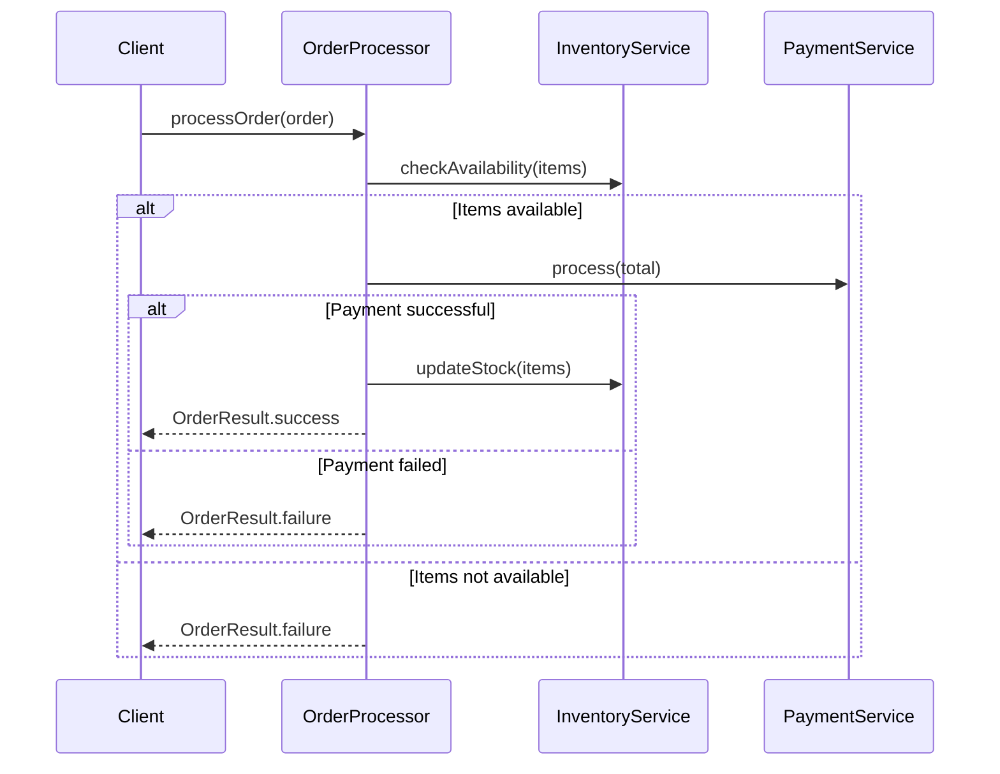

### Podejście manualne vs AI w dokumentacji

#### Podejście manualne:

##### Zalety:

1. **Dokładność**: Programista precyzyjnie opisuje wszystkie aspekty kodu
2. **Kontekst biznesowy**: Lepsze zrozumienie i przekazanie logiki biznesowej
3. **Spójność**: Jednolity styl dokumentacji w całym projekcie
4. **Świadome decyzje**: Celowy wybór co i jak dokumentować

##### Wady:

1. **Czasochłonność**: Pisanie dokumentacji zajmuje dużo czasu
2. **Niekompletność**: Można pominąć ważne szczegóły
3. **Nieaktualność**: Dokumentacja często nie nadąża za zmianami w kodzie
4. **Brak standardów**: Różni programiści mogą dokumentować w różny sposób

#### Podejście z AI:

##### Zalety:

1. **Szybkość**: Generowanie dokumentacji w kilka sekund
2. **Kompleksowość**: AI pamięta o dokumentowaniu wszystkich aspektów
3. **Formatowanie**: Automatyczne formatowanie zgodne z Markdown
4. **Spójność**: Jednolity styl w całym projekcie
5. **Aktualizacje**: Łatwiejsze utrzymywanie dokumentacji na bieżąco
6. **Wielojęzyczność**: Możliwość generowania w różnych językach

##### Wady:

1. **Ogólnikowość**: Czasem generuje zbyt ogólne opisy
2. **Kontekst**: Może brakować specyficznego kontekstu biznesowego
3. **Weryfikacja**: Wymaga sprawdzenia poprawności wygenerowanej treści
4. **Techniczny język**: Może być zbyt techniczne dla nietechnicznych odbiorców

### Najlepsze praktyki:

1. **Podejście hybrydowe**: Używaj AI do generowania szkieletu, uzupełniaj ręcznie o kontekst biznesowy
2. **Weryfikacja**: Zawsze sprawdzaj wygenerowaną dokumentację
3. **Aktualizacje**: Regularnie aktualizuj dokumentację przy zmianach w kodzie
4. **Standardy**: Ustal i utrzymuj spójne standardy dokumentacji

```java
public class OrderProcessor {
    private final PaymentService paymentService;
    private final InventoryService inventoryService;

    public OrderProcessor(PaymentService paymentService, InventoryService inventoryService) {
        this.paymentService = paymentService;
        this.inventoryService = inventoryService;
    }

    public OrderResult processOrder(Order order) throws PaymentException {
        if (!inventoryService.checkAvailability(order.getItems())) {
            return OrderResult.failure("Items not available");
        }

        PaymentResult payment = paymentService.process(order.getTotal());
        if (!payment.isSuccessful()) {
            return OrderResult.failure("Payment failed");
        }

        inventoryService.updateStock(order.getItems());
        return OrderResult.success(payment.getTransactionId());
    }
}
```

Podstawowa dokumentacja dla klasy `OrderProcessor`:

```markdown
# Order Processing System

## Klasa OrderProcessor

Klasa odpowiedzialna za przetwarzanie zamówień w systemie e-commerce.

### Zależności

- `PaymentService` - serwis obsługujący płatności
- `InventoryService` - serwis zarządzający stanami magazynowymi
```

### Diagram sekwencji

Diagram mermaid przedstawiający sekwencję przetwarzania zamówienia (w całości generowany automatycznie przez AI):



### Generowanie javadoca

Za pomocą AI można wygenerować szkielet dokumentacji Javadoc dla klasy `OrderProcessor`:

```java
/**
 * Processes orders by coordinating inventory checks and payment processing.
 * This class acts as a facade for the order processing workflow in the e-commerce system.
 *
 * @author Generated by AI
 * @version 1.0
 * @since 2024-03-20
 */
public class OrderProcessor {
    private final PaymentService paymentService;
    private final InventoryService inventoryService;

    /**
     * Constructs a new OrderProcessor with required dependencies.
     *
     * @param paymentService service responsible for payment processing
     * @param inventoryService service responsible for inventory management
     * @throws NullPointerException if any of the services is null
     */
    public OrderProcessor(PaymentService paymentService, InventoryService inventoryService) {
        this.paymentService = paymentService;
        this.inventoryService = inventoryService;
    }

    /**
     * Processes an order by checking inventory availability, processing payment,
     * and updating stock levels.
     *
     * <p>The method follows these steps:
     * <ol>
     *   <li>Verifies item availability in inventory</li>
     *   <li>Processes payment for the order</li>
     *   <li>Updates inventory stock levels</li>
     * </ol>
     *
     * <p>Example usage:
     * <pre>{@code
     * OrderProcessor processor = new OrderProcessor(paymentService, inventoryService);
     * Order order = new Order();
     * order.addItem(new OrderItem("Product1", 2));
     * OrderResult result = processor.processOrder(order);
     * }</pre>
     *
     * @param order the order to be processed
     * @return OrderResult containing either success with transaction ID or failure with error message
     * @throws PaymentException if payment processing fails due to technical issues
     * @throws NullPointerException if order is null
     * @see OrderResult
     * @see PaymentException
     */
    public OrderResult processOrder(Order order) throws PaymentException {
        if (!inventoryService.checkAvailability(order.getItems())) {
            return OrderResult.failure("Items not available");
        }

        PaymentResult payment = paymentService.process(order.getTotal());
        if (!payment.isSuccessful()) {
            return OrderResult.failure("Payment failed");
        }

        inventoryService.updateStock(order.getItems());
        return OrderResult.success(payment.getTransactionId());
    }
}
```
