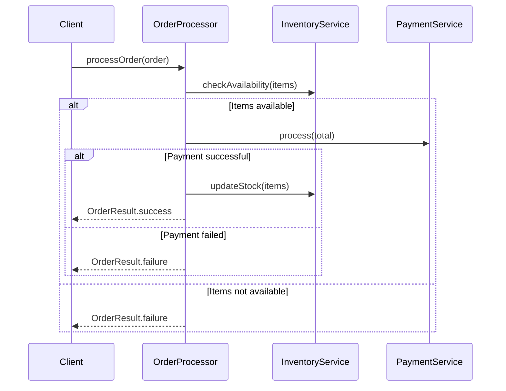

## Pomoc Ai w tworzeniu dokumentacji

## Podejście z AI:

#### Zalety:

1. **Szybkość**: Generowanie dokumentacji w kilka sekund
2. **Kompleksowość**: AI pamięta o dokumentowaniu wszystkich aspektów
3. **Formatowanie**: Automatyczne formatowanie zgodne z Markdown
4. **Spójność**: Jednolity styl w całym projekcie
5. **Aktualizacje**: Łatwiejsze utrzymywanie dokumentacji na bieżąco
6. **Wielojęzyczność**: Możliwość generowania w różnych językach

---

#### Wady:

1. **Brak kontekstu**: AI może nie zawsze zrozumieć kontekst biznesowy
2. **Weryfikacja**: Konieczność ręcznej weryfikacji wygenerowanej dokumentacji

---

#### Najlepsze praktyki:

1. **Podejście hybrydowe**: Używaj AI do generowania szkieletu, uzupełniaj ręcznie o kontekst biznesowy
2. **Weryfikacja**: Zawsze sprawdzaj wygenerowaną dokumentację
3. **Aktualizacje**: Regularnie aktualizuj dokumentację przy zmianach w kodzie
4. **Standardy**: Ustal i utrzymuj spójne standardy dokumentacji

---

## Przykładowe zadanie

Wyobraźmy sobie, że utworzyliśmy przykładowe klasy `OrderProcessor`, `PaymentService` i `InventoryService` w systemie obsługi zamówień. Otrzymaliśmy jednak sugestię, aby dodać dokumentację do klasy `OrderProcessor` i utworzyć diagram sekwencji dla metody `processOrder`. Oczywiście, możemy to zrobić ręcznie, ale z pomocą AI możemy to zrobić szybciej i bardziej spójnie.

**Kod klasy `OrderProcessor`:**

```java
public class OrderProcessor {
    private final PaymentService paymentService;
    private final InventoryService inventoryService;

    public OrderProcessor(PaymentService paymentService, InventoryService inventoryService) {
        this.paymentService = paymentService;
        this.inventoryService = inventoryService;
    }

    public OrderResult processOrder(Order order) throws PaymentException {
        if (!inventoryService.checkAvailability(order.getItems())) {
            return OrderResult.failure("Items not available");
        }

        PaymentResult payment = paymentService.process(order.getTotal());
        if (!payment.isSuccessful()) {
            return OrderResult.failure("Payment failed");
        }

        inventoryService.updateStock(order.getItems());
        return OrderResult.success(payment.getTransactionId());
    }
}
```

---

Teraz za pomocą prostego prompta AI możemy wygenerować dokumentację dla tej klasy:

```plaintext
Generuj dokumentację dla klasy OrderProcessor zależnej od PaymentService i InventoryService oraz diagramu sekwencji dla metody processOrder. Zwróc dokumentacje w formacie Markdown oraz diagram w formacie Mermaid.
```

---

Otrzymana dokumentacja dla klasy `OrderProcessor`:

```markdown
# Order Processing System

## Klasa OrderProcessor

Klasa odpowiedzialna za przetwarzanie zamówień w systemie e-commerce.

### Zależności

- `PaymentService` - serwis obsługujący płatności
- `InventoryService` - serwis zarządzający stanami magazynowymi
```

---

### Diagram sekwencji

Diagram mermaid przedstawiający sekwencję przetwarzania zamówienia (w całości generowany automatycznie przez AI):



## Generowanie javadoca

Wraz z upływem czasu, nasz kod na projekcie rośnie, a dokumentacja staje się coraz bardziej istotna. Dlatego warto zadbać o to, aby była ona aktualna i zgodna z kodem. AI może pomóc w generowaniu komentarzy Javadoc dla klas, metod i pól, co ułatwi zrozumienie kodu dla innych programistów (np. osób, które nie mają jeszcze wiedzy domenowej na naszym projekcie).

---

Za pomocą prompta AI możemy poprosić o wygenerowanie komentarzy Javadoc dla klasy `OrderProcessor`:

```plaintext
Generuj komentarze Javadoc dla klasy OrderProcessor z opisem konstruktora, metody processOrder oraz z opisem zależności PaymentService i InventoryService.
```

---

**W rezultacie otrzymujemy gotową klase wraz z komentarzami Javadoc:**

```java
/**
 * Processes orders by coordinating inventory checks and payment processing.
 * This class acts as a facade for the order processing workflow in the e-commerce system.
 *
 * @author Generated by AI
 * @version 1.0
 * @since 2024-03-20
 */
public class OrderProcessor {
    private final PaymentService paymentService;
    private final InventoryService inventoryService;

    /**
     * Constructs a new OrderProcessor with required dependencies.
     *
     * @param paymentService service responsible for payment processing
     * @param inventoryService service responsible for inventory management
     * @throws NullPointerException if any of the services is null
     */
    public OrderProcessor(PaymentService paymentService, InventoryService inventoryService) {
        this.paymentService = paymentService;
        this.inventoryService = inventoryService;
    }

    /**
     * Processes an order by checking inventory availability, processing payment,
     * and updating stock levels.
     *
     * <p>The method follows these steps:
     * <ol>
     *   <li>Verifies item availability in inventory</li>
     *   <li>Processes payment for the order</li>
     *   <li>Updates inventory stock levels</li>
     * </ol>
     *
     * <p>Example usage:
     * <pre>{@code
     * OrderProcessor processor = new OrderProcessor(paymentService, inventoryService);
     * Order order = new Order();
     * order.addItem(new OrderItem("Product1", 2));
     * OrderResult result = processor.processOrder(order);
     * }</pre>
     *
     * @param order the order to be processed
     * @return OrderResult containing either success with transaction ID or failure with error message
     * @throws PaymentException if payment processing fails due to technical issues
     * @throws NullPointerException if order is null
     * @see OrderResult
     * @see PaymentException
     */
    public OrderResult processOrder(Order order) throws PaymentException {
        if (!inventoryService.checkAvailability(order.getItems())) {
            return OrderResult.failure("Items not available");
        }

        PaymentResult payment = paymentService.process(order.getTotal());
        if (!payment.isSuccessful()) {
            return OrderResult.failure("Payment failed");
        }

        inventoryService.updateStock(order.getItems());
        return OrderResult.success(payment.getTransactionId());
    }
}
```

## Podsumowanie

AI może być skutecznym narzędziem w generowaniu dokumentacji, komentarzy Javadoc i diagramów dla kodu źródłowego. Dzięki temu programiści mogą skupić się na implementacji funkcjonalności, a AI zajmie się generowaniem dokumentacji. Warto jednak pamiętać, że AI nie zastąpi w pełni ludzkiego myślenia i weryfikacji, dlatego zawsze warto sprawdzić wygenerowaną dokumentację i dostosować ją do konkretnych potrzeb projektu.
